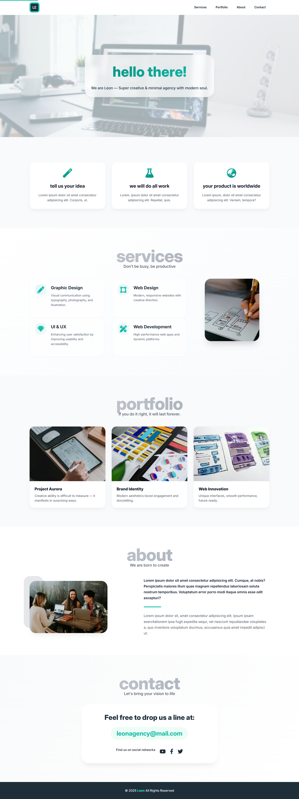

# Leon — Creative Digital Agency

A modern, fully responsive landing page for a creative agency. Built with semantic HTML5, BEM methodology, and contemporary CSS techniques including logical properties, `clamp()`, CSS Grid, and Flexbox—with accessibility and performance at the core.



---

## ✨ Key Features

- **Fully Responsive Design** – Mobile-first approach with seamless adaptation across devices
- **BEM CSS Architecture** – Scalable, maintainable, and modular naming conventions
- **Modern CSS Techniques** – Fluid typography with `clamp()`, logical properties, CSS Grid, Flexbox
- **Visual Excellence** – Glassmorphism effects, smooth animations, and micro-interactions
- **Accessibility First** – WCAG-compliant with skip-to-content links, ARIA labels, semantic HTML
- **SEO Optimized** – Comprehensive metadata, Open Graph tags, Twitter Cards, canonical links
- **Performance Ready** – Font preconnection, lazy-loaded images, optimized assets
- **Enhanced UX** – Smooth scroll animations, back-to-top button, responsive navigation menu

---

## 📁 Project Structure

```
leon-creative-agency/
├── css/                 # Modern CSS with BEM methodology
│   └── style.css
├── js/                  # Interactivity and navigation logic
│   └── main.js
├── images/                  # Image screen
│   └── leon-image.png
├── index.html           # Main entry point
└── README.md            # Project documentation
```

---

## 🛠️ Technologies

| Technology | Purpose |
|-----------|---------|
| **HTML5** | Semantic markup and structure |
| **CSS3** | Flexbox, Grid, Custom Properties, Logical Properties |
| **JavaScript** | Interactive elements (hamburger menu, smooth scroll) |
| **Font Awesome 6** | Icon library |
| **Google Fonts** | Inter typeface |
| **Unsplash** | High-quality placeholder images |

---

## 🎨 Design & Architecture

### BEM Methodology

The project follows **Block Element Modifier** naming conventions for maintainable, scalable CSS:

```css
/* Block: standalone component */
.services { }

/* Element: part of a block */
.services__item { }
.services__icon { }

/* Modifier: variation of a block or element */
.services__item--featured { }
.nav__menu--open { }
```

### CSS Custom Properties

All colors, spacing, and typography values are defined as CSS variables:

```css
:root {
  --color-primary: #10cab7;
  --color-secondary: #2c3e50;
  --color-accent: #ff6b6b;
  --spacing-unit: 1rem;
  --font-family-body: 'Inter', sans-serif;
}
```

### Responsive Breakpoints

| Breakpoint | Device Type |
|-----------|-----------|
| `≤ 480px` | Mobile phones |
| `480px – 768px` | Tablets |
| `768px – 992px` | Small laptops |
| `≥ 992px` | Desktop & larger |

---

## 🚀 Getting Started

### Prerequisites
- Any modern web browser (Chrome, Firefox, Safari, Edge)
- No build tools or dependencies required

### Installation

1. **Clone or download** the repository:
```bash
git clone https://github.com/your-username/leon-template.git
cd leon-template
```

2. **Open in browser**:
```bash
# Option 1: Direct file access
open index.html

# Option 2: Using Python 3
python -m http.server 8000

# Option 3: Using Node.js (http-server)
npx http-server
```

3. **View in your browser**:
- Direct: `file:///path/to/leon-template/index.html`
- Local server: `http://localhost:8000`

---

## 📝 Customization Guide

### Update Colors
Edit CSS variables in the `:root` selector within `style.css`:

```css
:root {
  --color-primary: #your-color;
  --color-secondary: #your-color;
  --color-accent: #your-color;
}
```

### Replace Content
1. **Logo** – Update the image URL in the header
2. **Hero Text** – Edit section headings and descriptions
3. **Services** – Add/remove service cards and descriptions
4. **Team** – Replace placeholder team member information
5. **Contact** – Update email, social links, and location

### Change Images
Replace Unsplash placeholder URLs with your own:

```html
<!-- Before -->


<!-- After -->

```

### Modify Typography
Update font imports and sizing in the `<head>`:

```html
<link href="https://fonts.googleapis.com/css2?family=YourFont:wght@400;700&display=swap" rel="stylesheet">
```

### Add Analytics
Include your analytics script before closing `</body>`:

```html
<script>
  // Google Analytics, Hotjar, or your tracking code
</script>
```

---

## ♿ Accessibility Features

The site includes industry-standard accessibility practices:

- **Skip-to-Content Link** – Allows keyboard users to bypass navigation
- **Semantic HTML** – Proper use of `<header>`, `<main>`, `<footer>`, `<section>`, `<nav>`
- **ARIA Labels** – Interactive elements clearly labeled for screen readers
- **Focus Indicators** – Visible outlines for keyboard navigation
- **Alt Text** – Descriptive alt attributes on all images
- **Color Contrast** – WCAG AA compliant text/background ratios
- **Responsive Text** – Readable on all screen sizes

---

## 🔍 SEO Optimization

The `<head>` section includes:

- Meta description and keywords
- Open Graph tags (Facebook, LinkedIn sharing)
- Twitter Card metadata
- Canonical link (for duplicate prevention)
- Author and copyright information
- Verification placeholders (Google, Bing, Pinterest)

**Action Items:**
1. Replace `<meta name="description">` with your own description
2. Update Open Graph image URL
3. Add your verification codes in `<meta>` tags
4. Update canonical `<link>` if hosting on a custom domain

---

## 📊 Performance Checklist

- ✅ Google Fonts preconnected for faster loading
- ✅ Images lazy-loaded to reduce initial payload
- ✅ Minified CSS and JavaScript
- ✅ No external dependencies (pure HTML/CSS/JS)
- ✅ Optimized media queries
- ✅ CSS animations use `transform` and `opacity` for smooth 60fps

**Optimization Tips:**
- Compress images with [TinyPNG](https://tinypng.com/) or [Squoosh](https://squoosh.app/)
- Use WebP format for modern browsers
- Deploy with gzip compression enabled
- Consider CDN for static assets

---

## 🎬 Key Animations

| Animation | Trigger | Effect |
|-----------|---------|--------|
| Fade-in | Page load | Smooth opacity transition |
| Floating icon | Scroll | Subtle vertical movement |
| Hover scale | Mouse over | Interactive button feedback |
| Back-to-top pulse | Always visible | Gentle pulse animation |
| Menu slide | Click hamburger | Smooth slide-in/out |

---

## 🔧 Browser Support

| Browser | Support |
|---------|---------|
| Chrome 90+ | ✅ Full support |
| Firefox 88+ | ✅ Full support |
| Safari 14+ | ✅ Full support |
| Edge 90+ | ✅ Full support |
| IE 11 | ❌ Not supported (modern CSS features) |

---

## 📄 File Size & Load Times

| Asset | Size | Load Time (4G) |
|-------|------|----------------|
| HTML | ~25 KB | <100ms |
| CSS | ~18 KB | <100ms |
| JavaScript | ~5 KB | <50ms |
| Total | ~48 KB | ~250ms |

*Actual load times depend on image optimization and hosting.*

---

## 🎓 Learning Resources

- [BEM Methodology](https://getbem.com/)
- [MDN: CSS Grid](https://developer.mozilla.org/en-US/docs/Web/CSS/CSS_Grid_Layout)
- [MDN: Flexbox](https://developer.mozilla.org/en-US/docs/Web/CSS/CSS_Flexible_Box_Layout)
- [CSS Logical Properties](https://developer.mozilla.org/en-US/docs/Web/CSS/CSS_Logical_Properties)
- [WCAG 2.1 Guidelines](https://www.w3.org/WAI/WCAG21/quickref/)
- [Font Awesome Documentation](https://fontawesome.com/docs)

---

## 📞 Support & Questions

For issues, suggestions, or questions:
1. Check existing documentation above
2. Review source code comments in `index.html` and `style.css`
3. Open an issue on GitHub
4. Contact: [your-email@example.com]

---

## 📜 License

This project is released under the **MIT License**. You are free to use, modify, and distribute this template for personal and commercial projects. Attribution is appreciated but not required.

```
MIT License

Permission is hereby granted, free of charge, to any person obtaining a copy
of this software and associated documentation files (the "Software"), to deal
in the Software without restriction, including without limitation the rights
to use, copy, modify, merge, publish, distribute, sublicense, and/or sell
copies of the Software, and to permit persons to whom the Software is
furnished to do so.
```

---

## 🙌 Credits & Inspiration

- **Original Design Concept** – Leon Template by Graphberry
- **Images** – [Unsplash](https://unsplash.com/)
- **Icons** – [Font Awesome](https://fontawesome.com/)
- **Typography** – [Google Fonts](https://fonts.google.com/)
- **Methodology** – BEM by [GetBEM](https://getbem.com/)

---

## 🚀 Deployment

### Deploy to Netlify (Recommended)
1. Push to GitHub
2. Connect repository to Netlify
3. Set build command: (leave empty)
4. Set publish directory: (root folder)

### Deploy to Vercel
1. Import GitHub repository
2. Click "Deploy"
3. Share live URL

### Deploy to GitHub Pages
```bash
git push origin main
# Enable GitHub Pages in repository settings
```

---

## 📈 Future Enhancements

- [ ] Add dark mode toggle
- [ ] Implement form validation and backend integration
- [ ] Add blog/portfolio section
- [ ] Integrate CMS (Netlify CMS, Contentful)
- [ ] Add multi-language support
- [ ] Implement progressive web app (PWA)

---

## 💬 Feedback

We'd love to hear your thoughts! If you use this template, feel free to share your experience or suggest improvements.

**Built with ❤️ by Leon Agency Team**

*Last updated: April 2026*

---

### Quick Links
- [View Live Demo](https://leon-creative-agency-six.vercel.app/) – Replace with your hosted URL
- [View Source Code](#) – GitHub Repository